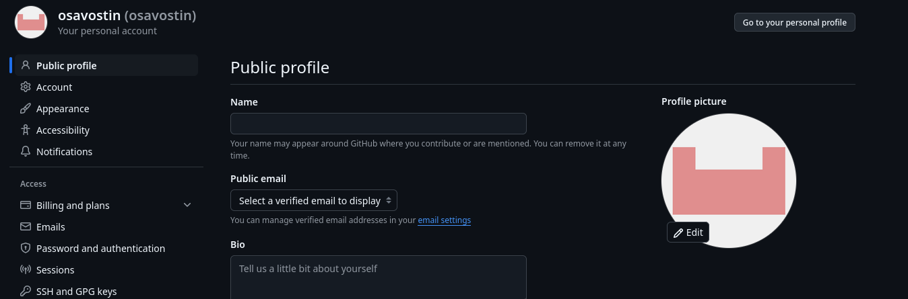

---
## Front matter
title: "Лабораторная работа №2"
subtitle: "Дисциплина: Архитектура компьютера"
author: "Савостин Олег"

## Generic otions
lang: ru-RU
toc-title: "Содержание"

## Bibliography
bibliography: bib/cite.bib
csl: pandoc/csl/gost-r-7-0-5-2008-numeric.csl

## Pdf output format
toc: true # Table of contents
toc-depth: 2
lof: true # List of figures
lot: true # List of tables
fontsize: 12pt
linestretch: 1.5
papersize: a4
documentclass: scrreprt
## I18n polyglossia
polyglossia-lang:
  name: russian
  options:
	- spelling=modern
	- babelshorthands=true
polyglossia-otherlangs:
  name: english
## I18n babel
babel-lang: russian
babel-otherlangs: english
## Fonts
mainfont: IBM Plex Serif
romanfont: IBM Plex Serif
sansfont: IBM Plex Sans
monofont: IBM Plex Mono
mathfont: STIX Two Math
mainfontoptions: Ligatures=Common,Ligatures=TeX,Scale=0.94
romanfontoptions: Ligatures=Common,Ligatures=TeX,Scale=0.94
sansfontoptions: Ligatures=Common,Ligatures=TeX,Scale=MatchLowercase,Scale=0.94
monofontoptions: Scale=MatchLowercase,Scale=0.94,FakeStretch=0.9
mathfontoptions:
## Biblatex
biblatex: true
biblio-style: "gost-numeric"
biblatexoptions:
  - parentracker=true
  - backend=biber
  - hyperref=auto
  - language=auto
  - autolang=other*
  - citestyle=gost-numeric
## Pandoc-crossref LaTeX customization
figureTitle: "Рис."
tableTitle: "Таблица"
listingTitle: "Листинг"
lofTitle: "Список иллюстраций"
lotTitle: "Список таблиц"
lolTitle: "Листинги"
## Misc options
indent: true
header-includes:
  - \usepackage{indentfirst}
  - \usepackage{float} # keep figures where there are in the text
  - \floatplacement{figure}{H} # keep figures where there are in the text
---

# Цель работы

Целью данной работы является изучить идеологию и применение средств
контроля версий и приобрести практические навыки по работе с системой
git

# Задание

1.  Настройка github
2.  Базовая настройка git
3.  Создание SSH ключа
4.  Сознание рабочего пространства и репозитория курса на основе шаблона
5.  Сознание репозитория курса на основе шаблона
6.  Настройка каталога курса
7.  Задания для самостоятельной работы
8.  Контрольные вопросы для самопроверки

# Теоретическое введение

Системы контроля версий (Version Control System, VCS) применяются при
работе нескольких человек над одним проектом. Обычно основное дерево
проекта хранится в локальном или удалённом репозитории, к которому
настроен доступ для участников проекта. При внесении изменений в
содержание проекта система контроля версий позволяет их фиксировать,
совмещать изменения, произведённые разными участниками проекта,
производить откат к любой более ранней версии проекта, если это
требуется.

В классических системах контроля версий используется централизованная
модель, предполагающая наличие единого репозитория для хранения файлов.
Выполнение большинства функций по управлению версиями осуществляется
специальным сервером. Участник проекта (пользователь) перед началом
работы посредством определённых команд получает нужную ему версию
файлов. После внесения изменений, пользователь размещает новую версию в
хранилище. При этом предыдущие версии не удаляются из центрального
хранилища и к ним можно вернуться в любой момент.

Системы контроля версий поддерживают возможность отслеживания и
разрешения конфликтов, которые могут возникнуть при работе нескольких
человек над одним файлом. Системы контроля версий также могут
обеспечивать дополнительные, более гибкие функциональные возможности

В отличие от классических, в распределенных системах контроля версий
центральный репозиторий не является обязательным. Среди классических VCS
наиболее известны CVS, Subversion, а среди распределенных --- Git,
Bazaar, Mercurial. Принципы их работы схожи, отличаются они в основном
синтаксисом используемых в работе команд.

Система контроля версий Git представляет собой набор программ командной
строки. Доступ к ним можно получить из терминала посредством ввода
команды git с различными опциями. Благодаря тому, что Git является
распределённой системой контроля версий, резервную копию локального
хранилища можно сделать простым копированием или архивацией

# Выполнение лабораторной работы

## Настройка github

Для начала пользования сервисом github, я захожу в браузер Firefox,
который является основным для Linux и перехожу на сайт https://www.github.com/(Pис. [-@fig:001]) и заполняю основные данные для регистрации. (Рис.[-@fig:002]) Аккаунт готов
(Рис.[-@fig:003]).

{#fig:001 width=70%}

{#fig:002 width=70%}

{#fig:003 width=70%}

## Базовая настройка git

Открываю терминал в Linux и ввожу команды git config \--global user.name
и git config \--global user.email, также указываю свои логин и почту
. Затем я настраиваю utf-8 в выводе сообщений git.
Задаю имя начальной ветки и будем называть её master.
Использую параметры autocrlf и safecrlf (Рис. [-@fig:004]).

{#fig:004 width=70%}

## Создание SSH ключа

Для последующей идентификации пользователя (меня) на сервере
репозиториев я сгенерирую пару ключей (приватный и открытый). Для этого
открываю терминал и ввожу команду ssh-keygen -C "Олег Савостин
<(mr.sans.san2@gmail.com)>". Ключ сохраняется в скрытой директории \~/.ssh/ (Рис. [-@fig:005])

{#fig:005 width=100%}

Чтобы загрузить данный ключ, я захожу на github.org, захожу в свой
аккаунт и захожу в настройки и выбираю опцию SSH and GPG keys (Рис. [-@fig:006])

{#fig:006 width=100%}

Выбираю New SSH key. (Рис. [-@fig:007])

{#fig:007 width=100%}

Чтобы скопировать ключ SSH в свой буфер обмена, мне следует установить пакет файлов xclip в терминале. После этого, я ввожу команду cat ~/.ssh/id_ed25519.pub | xclip -sel clip , где файл .pub является моим ключом. Я его и копирую. (Рис. [-@fig:008])

{#fig:008 width=100%}

Теперь, я вставляю скопированные данные в github (Рис. [-@fig:009])

{#fig:009 width=100%}

## Создание рабочего пространства и репозитория курса на основе шаблона

Так как при выполнении лабораторных работ следует придерживаться структуры рабочего пространства, я создам каталог для предмета “Архитектура компьютера”(Рис. [-@fig:010])

{#fig:010 width=100%}

## Создание репозитория курса на основе шаблона

Захожу в web-интерфейс github и перехожу на страницу репозитория с шаблонов https://github.com/yamadharma/course-directory-student-template (Рис. [-@fig:011])

{#fig:011 width=100%}

Теперь использую этот шаблон, нажимая на Use this template и Create new repository. Затем, задаю ему название study_2023-2023_arch-pc и нажимаю Create repository (Рис. [-@fig:012])

{#fig:012 width=100%}

Теперь, я захожу в терминал, и перехожу в каталог “Архитектура компьютера” с помощью команды ~/work/study/2024-2025/”Архитектура компьютера”. В данный подкаталог я скопирую всё, что было в репозитории с помощью команды  git clone --recursive git@github.com:osavostin/study_2023-2024_arh-pc.git arch-pc (Рис. [-@fig:013])

{#fig:013 width=100%}

Ссылка не была использована в данном случае, но это можно сделать следующим образом (Рис. [-@fig:014])

{#fig:014 width=100%}

## Настройка каталога курса

Сперва, в терминале я перехожу в каталог курса с помощью утилиты cd в каталог arch-pc и удаляю лишний файл package.json с помощью rm, проверяю на его наличие. Затем создаю необходимые каталоги с помощью echo arch-pc > COURSE. Устанавливаю пакет make и пользуюсь этой командой  (Рис. [-@fig:015])

{#fig:015 width=100%}

Теперь отправляю файлы на сервер с помощью git add .; git commit -am; git push. Последняя команда отправляет все файлы на github.(Рис. [-@fig:016])

{#fig:016 width=100%}

Проверяю если файл загрузился. (Рис. [-@fig:017])

{#fig:017 width=70%}

## Задания для самостоятельной работы

1. Создаю отчет по выполнению лабораторной работы в labs/lab02/report/ с помощью утилиты touch(Рис. [-@fig:018])

{#fig:018 width=100%}

2. Копирую предыдущие лабораторные работы в соответствующие им каталоги. Предыдущая работа находилась в каталоге Документы. С помощью cp и ls я копирую данный файл в соответствующий каталог в рабочем пространстве и проверяю на его наличие(Рис. [-@fig:019])

{#fig:019 width=100%}

3. Теперь загружаю файлы на github используя git add .; git commit -m; git push.(Рис. [-@fig:020])

{#fig:020 width=100%}

Как итог, всё прошло успешно. (Рис. [-@fig:021])

{#fig:021 width=100%}

# Выводы

При выполнении данной лабораторной работы я изучил применение средств контроля версий, а также приобрел  практические навыки по работе с системой git и узнал как пересылать файлы на github.

# Список литературы{.unnumbered}

[[Архитектура
    ЭВМ]{.underline}](https://esystem.rudn.ru/pluginfile.php/2089527/mod_resource/content/0/%D0%9B%D0%B0%D0%B1%D0%BE%D1%80%D0%B0%D1%82%D0%BE%D1%80%D0%BD%D0%B0%D1%8F%20%D1%80%D0%B0%D0%B1%D0%BE%D1%82%D0%B0%20%E2%84%962.%20%D0%A1%D0%B8%D1%81%D1%82%D0%B5%D0%BC%D0%B0%20%D0%BA%D0%BE%D0%BD%D1%82%D1%80%D0%BE%D0%BB%D1%8F%20%D0%B2%D0%B5%D1%80%D1%81%D0%B8%D0%B9%20Git.pdf)
    РУДН

::: {#refs}
:::
