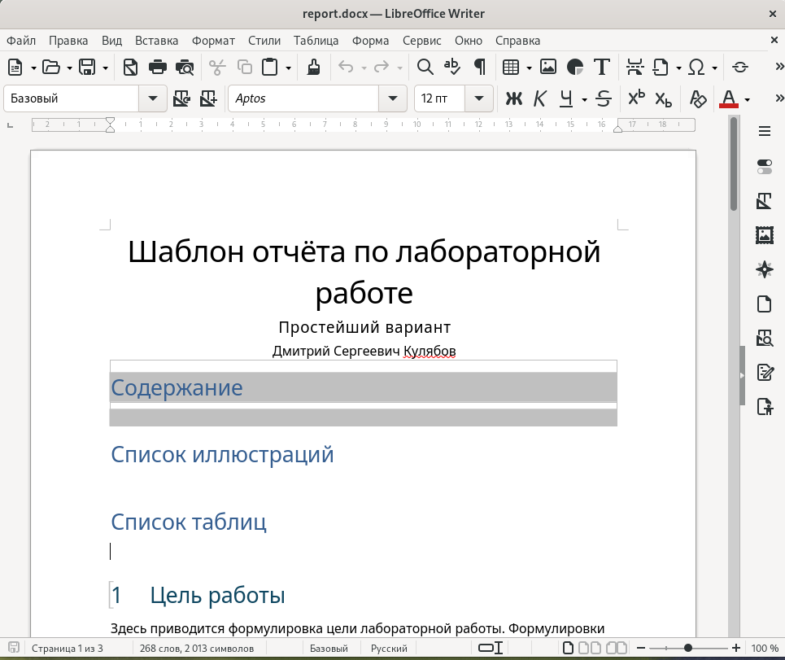

---
## Front matter
title: "Отчёт по лабораторной работе №4"
subtitle: "Дисциплина: Архитектура компьютера"
author: "Савостин Олег"

## Generic otions
lang: ru-RU
toc-title: "Содержание"

## Bibliography
bibliography: bib/cite.bib
csl: pandoc/csl/gost-r-7-0-5-2008-numeric.csl

## Pdf output format
toc: true # Table of contents
toc-depth: 2
lof: true # List of figures
lot: true # List of tables
fontsize: 12pt
linestretch: 1.5
papersize: a4
documentclass: scrreprt
## I18n polyglossia
polyglossia-lang:
  name: russian
  options:
	- spelling=modern
	- babelshorthands=true
polyglossia-otherlangs:
  name: english
## I18n babel
babel-lang: russian
babel-otherlangs: english
## Fonts
mainfont: IBM Plex Serif
romanfont: IBM Plex Serif
sansfont: IBM Plex Sans
monofont: IBM Plex Mono
mathfont: STIX Two Math
mainfontoptions: Ligatures=Common,Ligatures=TeX,Scale=0.94
romanfontoptions: Ligatures=Common,Ligatures=TeX,Scale=0.94
sansfontoptions: Ligatures=Common,Ligatures=TeX,Scale=MatchLowercase,Scale=0.94
monofontoptions: Scale=MatchLowercase,Scale=0.94,FakeStretch=0.9
mathfontoptions:
## Biblatex
biblatex: true
biblio-style: "gost-numeric"
biblatexoptions:
  - parentracker=true
  - backend=biber
  - hyperref=auto
  - language=auto
  - autolang=other*
  - citestyle=gost-numeric
## Pandoc-crossref LaTeX customization
figureTitle: "Рис."
tableTitle: "Таблица"
listingTitle: "Листинг"
lofTitle: "Список иллюстраций"
lotTitle: "Список таблиц"
lolTitle: "Листинги"
## Misc options
indent: true
header-includes:
  - \usepackage{indentfirst}
  - \usepackage{float} # keep figures where there are in the text
  - \floatplacement{figure}{H} # keep figures where there are in the text
---

# Цель работы

Целью данной лабораторной работы является освоение процедуры оформления отчетов с помощью легковесного языка разметки Markdown.

# Задание
    1. Установка технического обеспечения или проверка на её наличие в системе.
    2. Выполнение лабораторной работы
    3. Выполнение задания для самостоятельной работы

# Теоретическое введение

Markdown — облегчённый язык разметки, созданный с целью обозначения форматирования в простом тексте, с максимальным сохранением его читаемости человеком, и пригодный для машинного преобразования в языки для продвинутых публикаций. Markdown поддерживает как встраивание фрагментов кода в предложение, так и их размещение между предложениями в виде отдельных огражденных блоков. Огражденные блоки кода — это простой способ выделить синтаксис для фрагментов кода. Общий формат огражденных блоков кода. Внутритекстовые формулы делаются аналогично формулам LaTeX. В Markdown вставить изображение в документ можно с помощью непосредственного указания адреса изображения.

# Выполнение лабораторной работы

Для выполнения лабораторной работы, мне необходимо было установить pandoc и LaTex, так как с помощью их можно преобразовать файлы типы .md в .pdf и .docx. На моём компьютеры они были установлены. В данной работе я буду использовать pandoc 3.5 и полный пакет LaTex (рис.[-@fig:001]).

{#fig:001 width=100%}

Для начала лабораторной работы, я открываю терминал с помощью списка приложения Linux (рис. [-@fig:002]).

{#fig:002 width=100%}

Открываю терминал (рис. [-@fig:003]).

{#fig:003 width=70%}

Теперь перехожу в каталог курса сформированный при выполнении лабораторной работы №2 с помощью утилиты 'cd' и использую команду "git pull" чтобы обновить репозиторий (рис. [-@fig:004])

{#fig:004 width=70%}

Затем перехожу в каталог с шаблонов отчета по лабораторной работе. Перехожу в labs/lab03/report (рис. [-@fig:005])

{#fig:005 width=100%}

Ввожу команду `make`, которая преобразует файл report.md в report.pdf и report.docx с помощью файла Makefile (рис. [-@fig:006])

{#fig:006 width=100%}

Проверяю на наличие новых файлов (рис. [-@fig:007])

{#fig:007 width=100%}

Так как через терминал точно не узнать, если файлы были корректно преобразованы, я их открываю и проверяю. Сперва pdf (рис. [-@fig:008]) и затем docx (рис. [-@fig:009])

{#fig:008 width=80%}

{#fig:009 width=80%}

Я убедился в том, что файлы были преобразованы корректно. Удаляю их с помощи команды `make clean` и проверяю если их удалили (рис. [-@fig:010])

{#fig:010 width=100%}

Открываю файл report.md с помощью терминала командой `gedit report.md` и изучаю данные файла (рис. [-@fig:011])

{#fig:011 width=100%}

После изучение данного файла, я заполняю данный отчет по шаблону. После заполнения отчета, я скомпилирую его и проверяю корректность. (рис. [-@fig:012])(рис. [-@fig:013])(рис. [-@fig:014])(рис. [-@fig:015])

{#fig:012 width=100%}

{#fig:013 width=100%}

{#fig:014 width=100%}

{#fig:015 width=100%}

# Выводы

Здесь кратко описываются итоги проделанной работы.

# Список литературы{.unnumbered}

::: {#refs}
:::
