---
## Front matter
title: "Отчёт по лабораторной работе №4"
subtitle: "Дисциплина: Архитектура компьютера"
author: "Савостин Олег"

## Generic otions
lang: ru-RU
toc-title: "Содержание"

## Bibliography
bibliography: bib/cite.bib
csl: pandoc/csl/gost-r-7-0-5-2008-numeric.csl

## Pdf output format
toc: true # Table of contents
toc-depth: 2
lof: true # List of figures
lot: true # List of tables
fontsize: 12pt
linestretch: 1.5
papersize: a4
documentclass: scrreprt
## I18n polyglossia
polyglossia-lang:
  name: russian
  options:
	- spelling=modern
	- babelshorthands=true
polyglossia-otherlangs:
  name: english
## I18n babel
babel-lang: russian
babel-otherlangs: english
## Fonts
mainfont: IBM Plex Serif
romanfont: IBM Plex Serif
sansfont: IBM Plex Sans
monofont: IBM Plex Mono
mathfont: STIX Two Math
mainfontoptions: Ligatures=Common,Ligatures=TeX,Scale=0.94
romanfontoptions: Ligatures=Common,Ligatures=TeX,Scale=0.94
sansfontoptions: Ligatures=Common,Ligatures=TeX,Scale=MatchLowercase,Scale=0.94
monofontoptions: Scale=MatchLowercase,Scale=0.94,FakeStretch=0.9
mathfontoptions:
## Biblatex
biblatex: true
biblio-style: "gost-numeric"
biblatexoptions:
  - parentracker=true
  - backend=biber
  - hyperref=auto
  - language=auto
  - autolang=other*
  - citestyle=gost-numeric
## Pandoc-crossref LaTeX customization
figureTitle: "Рис."
tableTitle: "Таблица"
listingTitle: "Листинг"
lofTitle: "Список иллюстраций"
lotTitle: "Список таблиц"
lolTitle: "Листинги"
## Misc options
indent: true
header-includes:
  - \usepackage{indentfirst}
  - \usepackage{float} # keep figures where there are in the text
  - \floatplacement{figure}{H} # keep figures where there are in the text
---

# Цель работы

Цель данной лабораторной работы является освоение процедуры компиляции и сборки программ, написанных на ассемблере NASM.

# Задание

    1. Изучение программы Hello world!
    2. Транслятор NASM
    3. Расширенный синтаксис командной строки NASM
    4. Компоновщик LD
    5. Запуск исполняемого файла
    6. Выполнение заданий самостоятельной работы

# Теоретическое введение

Основными функциональными элементами любой электронно-вычислительной машины(ЭВМ) являются центральный процессор, память и периферийные устройства.Взаимодействие этих устройств осуществляется через общую шину, к которой они подключены. Физически шина представляет собой большое количество проводников, соединяющих устройства друг с другом. В современных компьютерах проводники выполнены в виде электропроводящих дорожек на материнской (системной) плате.
    Основной задачей процессора является обработка информации, а также организация
координации всех узлов компьютера. В состав центрального процессора (ЦП) входят
следующие устройства:
    • арифметико-логическое устройство (АЛУ) — выполняет логические и арифметические действия, необходимые для обработки информации, хранящейся в памяти;
    • устройство управления (УУ) — обеспечивает управление и контроль всех устройств компьютера;
    • регистры — сверхбыстрая оперативная память небольшого объёма, входящая в состав процессора, для временного хранения промежуточных результатов выполнения инструкций; 
    Важным узлом ЭВМ является оперативное запоминающее устройство (ОЗУ).
ОЗУ — это быстродействующее энергозависимое запоминающее устройство, которое на-
прямую взаимодействует с узлами процессора, предназначенное для хранения программ и
данных, с которыми процессор непосредственно работает в текущий момент.
    Язык ассемблера (assembly language, сокращённо asm) — машинно-ориентированный
язык низкого уровня. Можно считать, что он больше любых других языков приближен к
архитектуре ЭВМ и её аппаратным возможностям, что позволяет получить к ним более
полный доступ, нежели в языках высокого уровня, таких как C/C++, Perl, Python и пр.

# Выполнение лабораторной работы

## Изучение программы Hello world!

Для начала выполнения лабораторной работы, я перехожу в каталог "lab04" с помощью утилиты "cd"(рис. [-@fig:001]).

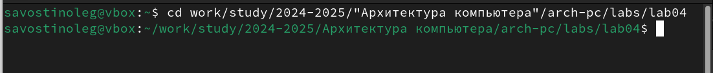{#fig:001 width=100%}

Затем я создаю новый файл под названием "hello.asm"(рис. [-@fig:002]) и открываю новый файл с помощью gedit(рис. [-@fig:003])

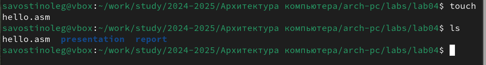{#fig:002 width=100%}

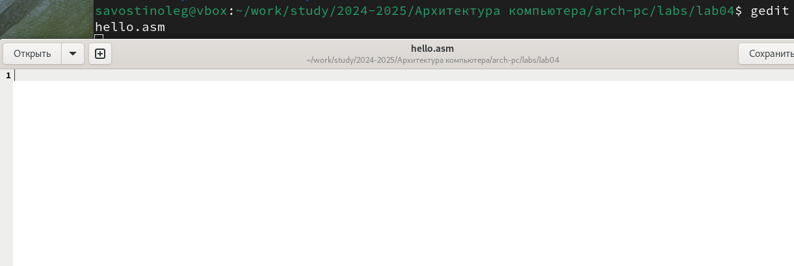{#fig:003 width=100%}

Теперь, я ввожу текст в данный файл, который был предоставлен в файле лабораторной работы ([-@fig:004])

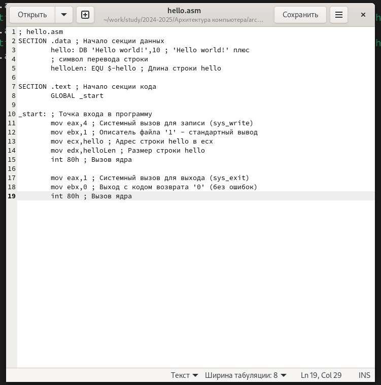{#fig:004 width=100%}

## Транслятор NASM

NASM превращает текст программы в объектный код. Для компиляции текста в файле "hello.asm" я ввожу команду "nasm -f elf hello.asm" ([-@fig:005])

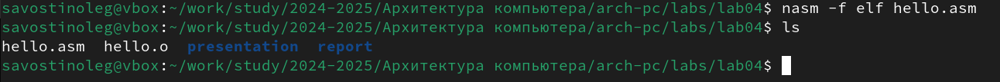{#fig:005 width=100%}

Компиляция прошла успешно и как видно на изображении, появился файл hello.o

## Расширенный синтаксис командной строки NASM

Теперь я скомпилирую исходный файл hello.asm в obj.o и кроме того, будет создан
файл листинга list.lst. Затем проверяю на правильность выполнения команды.([-@fig:006])

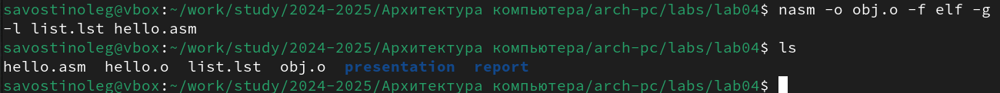{#fig:006 width=100%}

## Компоновщик LD

Теперь, я передаю объектный файл на обработку компоновщику с помощью команды ld -m elf_i386 hello.o -o hello и проверяю если исполняемый файл hello был создан.([-@fig:007])

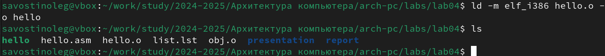{#fig:007 width=100%}

Ключ -o с последующим значением задаёт в данном случае имя создаваемого исполняемого файла и чтобы проверить это я ввожу команду: ld -m elf_i386 obj.o -o main , после которой появляется файл main.([-@fig:008])

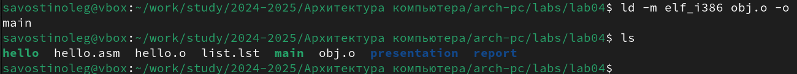{#fig:008 width=100%}

## Запуск исполняемого файла

И теперь я запускаю на выполнение файл, вводя команду в командной строке: ./hello , что выводит на экран Hello world!([-@fig:009])

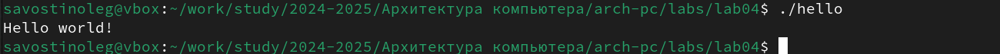{#fig:009 width=100%}

## Выполнение заданий самостоятельной работы

1.  В каталоге ~/work/arch-pc/lab04 с помощью команды cp создаю копию файла hello.asm с именем lab4.asm и проверяю на его наличие([-@fig:010])

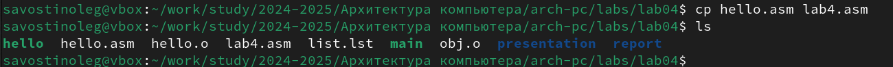{#fig:010 width=100%}

2.  С помощью программного текстового редактора вношу изменения в текст программы в файле lab4.asm так, чтобы вместо Hello world! на экран выводилась строка с моими фамилией и именем([-@fig:011])

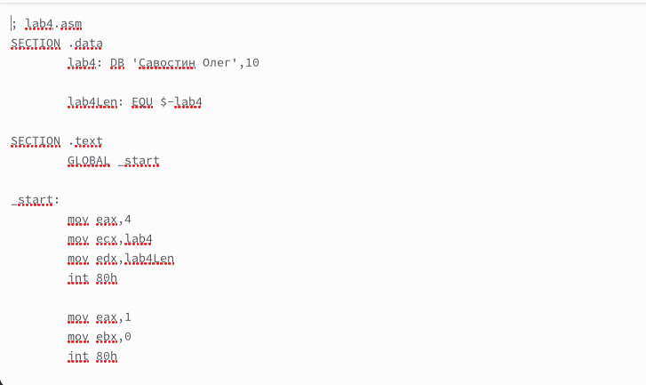{#fig:011 width=100%}

3.  Транслирую полученный текст программы lab4.asm в объектный файл. Затем выполняю компоновку объектного файла и запускаю получившийся исполняемый файл([-@fig:012])

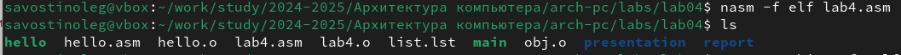{#fig:012 width=100%}

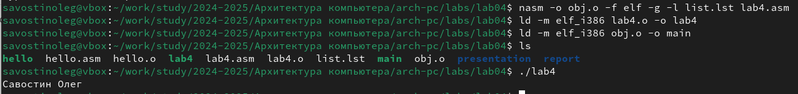{#fig:013 width=100%}

4.  Так как файлы hello.asm и lab4.asm уже находятся в нужном репозитории, я их только отправляю на Github.([-@fig:014])

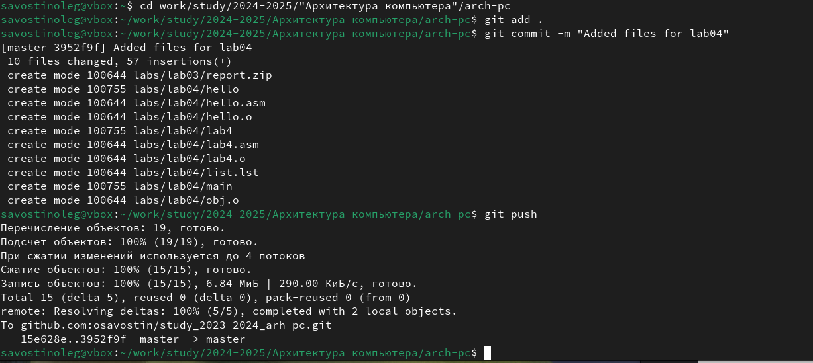{#fig:014 width=100%}

# Выводы

В ходе данной лабораторной работы я освоил процедуры компиляции и сборки программ, написанных на ассемблере NASM.

# Список литературы{.unnumbered}

1. [Архитектура ЭВМ - РУДН](https://esystem.rudn.ru/pluginfile.php/2089533/mod_resource/content/0/%D0%9B%D0%B0%D0%B1%D0%BE%D1%80%D0%B0%D1%82%D0%BE%D1%80%D0%BD%D0%B0%D1%8F%20%D1%80%D0%B0%D0%B1%D0%BE%D1%82%D0%B0%20%E2%84%964.%20%D0%A1%D0%BE%D0%B7%D0%B4%D0%B0%D0%BD%D0%B8%D0%B5%20%D0%B8%20%D0%BF%D1%80%D0%BE%D1%86%D0%B5%D1%81%D1%81%20%D0%BE%D0%B1%D1%80%D0%B0%D0%B1%D0%BE%D1%82%D0%BA%D0%B8%20%D0%BF%D1%80%D0%BE%D0%B3%D1%80%D0%B0%D0%BC%D0%BC%20%D0%BD%D0%B0%20%D1%8F%D0%B7%D1%8B%D0%BA%D0%B5%20%D0%B0%D1%81%D1%81%D0%B5%D0%BC%D0%B1%D0%BB%D0%B5%D1%80%D0%B0%20NASM.pdf) 

::: {#refs}
:::
