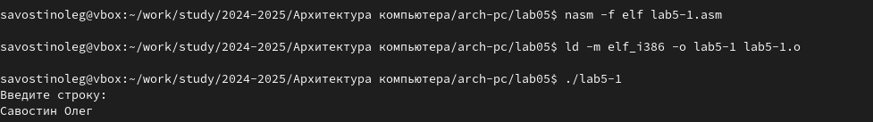

---
## Front matter
title: "Лабораторная работа №5"
subtitle: "Дисциплина: Архитектура компьютера"
author: "Савостин Олег"

## Generic otions
lang: ru-RU
toc-title: "Содержание"

## Bibliography
bibliography: bib/cite.bib
csl: pandoc/csl/gost-r-7-0-5-2008-numeric.csl

## Pdf output format
toc: true # Table of contents
toc-depth: 2
lof: true # List of figures
lot: true # List of tables
fontsize: 12pt
linestretch: 1.5
papersize: a4
documentclass: scrreprt
## I18n polyglossia
polyglossia-lang:
  name: russian
  options:
	- spelling=modern
	- babelshorthands=true
polyglossia-otherlangs:
  name: english
## I18n babel
babel-lang: russian
babel-otherlangs: english
## Fonts
mainfont: IBM Plex Serif
romanfont: IBM Plex Serif
sansfont: IBM Plex Sans
monofont: IBM Plex Mono
mathfont: STIX Two Math
mainfontoptions: Ligatures=Common,Ligatures=TeX,Scale=0.94
romanfontoptions: Ligatures=Common,Ligatures=TeX,Scale=0.94
sansfontoptions: Ligatures=Common,Ligatures=TeX,Scale=MatchLowercase,Scale=0.94
monofontoptions: Scale=MatchLowercase,Scale=0.94,FakeStretch=0.9
mathfontoptions:
## Biblatex
biblatex: true
biblio-style: "gost-numeric"
biblatexoptions:
  - parentracker=true
  - backend=biber
  - hyperref=auto
  - language=auto
  - autolang=other*
  - citestyle=gost-numeric
## Pandoc-crossref LaTeX customization
figureTitle: "Рис."
tableTitle: "Таблица"
listingTitle: "Листинг"
lofTitle: "Список иллюстраций"
lotTitle: "Список таблиц"
lolTitle: "Листинги"
## Misc options
indent: true
header-includes:
  - \usepackage{indentfirst}
  - \usepackage{float} # keep figures where there are in the text
  - \floatplacement{figure}{H} # keep figures where there are in the text
---

# Цель работы

Целью данной работы является приобретение практических навыков работы в Midnight Commander. Освоение инструкций языка ассемблера mov и int.  

# Задание

1. Основы работы с mc
2. Подключение внешнего файла
3. Выполнение заданий для самостоятельной работы

# Теоретическое введение

Midnight Commander (или просто mc) — это программа, которая позволяет просматривать
структуру каталогов и выполнять основные операции по управлению файловой системой,
т.е. mc является файловым менеджером. Midnight Commander позволяет сделать работу с
файлами более удобной и наглядной

Программа на языке ассемблера NASM, как правило, состоит из трёх секций: секция кода
программы (SECTION .text), секция инициированных (известных во время компиляции)
данных (SECTION .data) и секция неинициализированных данных (тех, под которые во
время компиляции только отводится память, а значение присваивается в ходе выполнения
программы) (SECTION .bss)

Программа на языке ассемблера NASM, как правило, состоит из трёх секций: секция кода
программы (SECTION .text), секция инициированных (известных во время компиляции)
данных (SECTION .data) и секция неинициализированных данных (тех, под которые во
время компиляции только отводится память, а значение присваивается в ходе выполнения
программы) (SECTION .bss)

Инструкция языка ассемблера intпредназначена для вызова прерывания с указанным
номером. В общем виде она записывается в виде
int n
Здесь n — номер прерывания, принадлежащий диапазону 0–255.
Простейший диалог с пользователем требует наличия двух функций — вывода текста на
экран и ввода текста с клавиатуры. Простейший способ вывести строку на экран — использо-
вать системный вызов write. Этот системный вызов имеет номер 4, поэтому перед вызовом
инструкции int необходимо поместить значение 4 в регистр eax. Первым аргументом write,
помещаемым в регистр ebx, задаётся дескриптор файла. Для вывода на экран в качестве
дескриптора файла нужно указать 1 (это означает «стандартный вывод», т. е. вывод на экран).
Вторым аргументом задаётся адрес выводимой строки (помещаем его в регистр ecx, напри-
мер, инструкцией mov ecx, msg). Строка может иметь любую длину. Последним аргументом
(т.е. в регистре edx) должна задаваться максимальная длина выводимой строки.

# Выполнение лабораторной работы

## Основы работы с mc

Сперва, я открываю терминал и открываю Midnight Commander с помощью команды "mc" (рис. [-@fig:001])

{#fig:001 width=70%}

Затем, я перехожу в каталог arch-pc и создаю новую папку "lab05" с помощью клавиши F7 (рис. [-@fig:002])(рис. [-@fig:003])(рис. [-@fig:004])

{#fig:002 width=70%} 

{#fig:003 width=70%} 

{#fig:004 width=70%} 

Теперь с помощью командной строки создаю файл lab5-1.asm c touch (рис. [-@fig:005])(рис. [-@fig:006])

{#fig:005 width=70%} 

{#fig:006 width=70%}

Открываю мною созданный файл с помощью текстового редактора и вставляю туда текст, предоставленный в документе Архитектура ЭВМ (рис. [-@fig:007]). Транслирую текст в объектный файл, компилирую его и затем запускаю исполняемый файл. Программа вводит текст 'Введите строку:', после чего я вводу свои ФИ. (рис. [-@fig:008])

{#fig:007 width=70%} 

{#fig:008 width=70%} 

## Подключение внешнего файла.

Сначала, я устанавилваю файл  in_out.asm со страницы курса в ТУИС и переношу его в каталог, в котором он будет использован (рис. [-@fig:009])

{#fig:009 width=70%}

Теперь, с помощью функциональной клавиши F6 я создаю копию файла lab5-1.asm с именем lab5-2.asm. Выделяю файл lab5-1.asm, нажимаю клавишу F6 и ввожу название lab5-2.asm (рис. [-@fig:010])

{#fig:010 width=70%}

Изменяю содержимое файла на текст, предоставленный на странице курса в ТУИС (рис. [-@fig:011])

{#fig:011 width=70%}

Создаю файл и проверяю его работу(рис. [-@fig:012])

{#fig:012 width=70%}

Теперь, изменяю sprintLF на sprint(рис. [-@fig:013]). Разница состоим в том, что теперь вводимый мною текст теперь находится на одной строчке с "Введите строку:", когда в прошлый раз текст переходил на новую строчку (рис. [-@fig:014])

{#fig:013 width=70%}
 
{#fig:014 width=70%}

## Выполнение заданий для самостоятельной работы

Создаю копию файла lab5-1.asm - lab5-1.1.asm(рис. [-@fig:015])

{#fig:015 width=70%}

Редактирую содержимое файла чтобы он работал по алгоритму (1):
• вывести приглашение типа “Введите строку:”;
• ввести строку с клавиатуры;
• вывести введённую строку на экран.(рис. [-@fig:016])

{#fig:016 width=70%} 

Теперь проверяю на правильность выполнения изменения файла. Всё сделано верно.(рис. [-@fig:017])

{#fig:017 width=70%} 

Текст кода в Рис.16 :
SECTION .data ; Секция инициированных данных

msg: DB 'Введите строку:',10 ; сообщение плюс

msgLen: EQU $-msg ; Длина переменной 'msg'

SECTION .bss ; Секция не инициированных данных

buf1: RESB 80 ; Буфер размером 80 байт

SECTION .text ; Код программы

GLOBAL _start ; Начало программы

_start

mov eax,4 ; Системный вызов для записи (sys_write)

mov ebx,1 ; Описатель файла 1 - стандартный вывод

mov ecx,msg ; Адрес строки 'msg' в 'ecx'

mov edx,msgLen ; Размер строки 'msg' в 'edx'

int 80h ; Вызов ядра

mov eax, 3 ; Системный вызов для чтения (sys_read)

mov ebx, 0 ; Дескриптор файла 0 - стандартный ввод

mov ecx, buf1 ; Адрес буфера под вводимую строку

mov edx, 80 ; Длина вводимой строки

int 80h ; Вызов ядра

mov eax,4 ; Системный вызов для записи

mov ebx,1 ;

mov ecx,buf1 ;

mov edx,buf1 ;

int 80h ;

mov eax,1 ; Системный вызов для выхода (sys_exit)

mov ebx,0 ; Выход с кодом возврата 0 (без ошибок)

int 80h ; Вызов ядра

Теперь делаю подобную программу, только с использованием in_out.asm. Сперва, я создаю копию файла lab5-2.asm и возвращаю файл in_out.asm(рис. [-@fig:018])

{#fig:018 width=70%} 

Затем, я редактирую текст файла, чтобы он повторял подобный алгоритм (1).(рис. [-@fig:019])

{#fig:019 width=70%} 

Теперь, подобно предыдущему разу, я проверяю на правильность выполнения работы.Всё сделано корректно (рис. [-@fig:020])

{#fig:020 width=70%} 

Код из второго файла:

%include 'in_out.asm' ; подключение внешнего файла

SECTION .data ; Секция инициированных данных

msg: DB 'Введите строку: ',0h ; сообщение

SECTION .bss ; Секция не инициированных данных

buf1: RESB 80 ; Буфер размером 80 байт

SECTION .text ; Код программы

GLOBAL _start ; Начало программы

_start: ; Точка входа в программу

mov eax, msg ; запись адреса выводимого сообщения в `EAX`

call sprint ; вызов подпрограммы печати сообщения

mov ecx, buf1 ; запись адреса переменной в `EAX`

mov edx, 80 ; запись длины вводимого сообщения в `EBX`

call sread ; вызов подпрограммы ввода сообщения

mov eax,4 ;

mov ebx,1 ;

mov ecx,buf1 ;

int 80h ;

# Выводы 

При выполнении лабораторной работы я приобрел практические навыки работы в
Midnight Commander и освоил инструкции языка ассемблера mov и int.

# Список литературы{.unnumbered}

1. [Лабораторная работа
№5](https://esystem.rudn.ru/pluginfile.php/2089538/mod_resource/content/0/%D0%9B%D0%B0%D0%B1%D0%BE%D1%80%D0%B0%D1%82%D0%BE%D1%80%D0%BD%D0%B0%D1%8F%20%D1%80%D0%B0%D0%B1%D0%BE%D1%82%D0%B0%20%E2%84%965.%20%D0%9E%D1%81%D0%BD%D0%BE%D0%B2%D1%8B%20%D1%80%D0%B0%D0%B1%D0%BE%D1%82%D1%8B%20%D1%81%20Midnight%20Commander%20%28%29.%20%D0%A1%D1%82%D1%80%D1%83%D0%BA%D1%82%D1%83%D1%80%D0%B0%20%D0%BF%D1%80%D0%BE%D0%B3%D1%80%D0%B0%D0%BC%D0%BC%D1%8B%20%D0%BD%D0%B0%20%D1%8F%D0%B7%D1%8B%D0%BA%D0%B5%20%D0%B0%D1%81%D1%81%D0%B5%D0%BC%D0%B1%D0%BB%D0%B5%D1%80%D0%B0%20NASM.%20%D0%A1%D0%B8%D1%81%D1%82%D0%B5%D0%BC%D0%BD%D1%8B%D0%B5%20%D0%B2%D1%8B%D0%B7%D0%BE%D0%B2%D1%8B%20%D0%B2%20%D0%9E%D0%A1%20GNU%20Linux.pdf)
