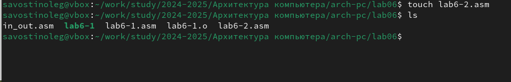
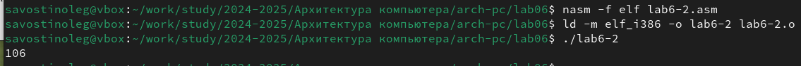
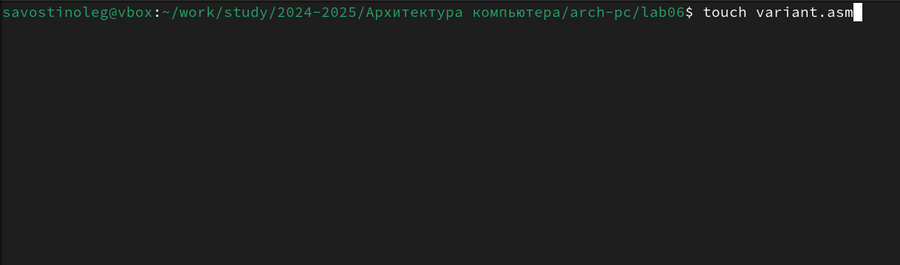

---
## Front matter
title: "Лабораторная работа №6"
subtitle: "Дисциплина: Архитектура компьютера"
author: "Савостин Олег"

## Generic otions
lang: ru-RU
toc-title: "Содержание"

## Bibliography
bibliography: bib/cite.bib
csl: pandoc/csl/gost-r-7-0-5-2008-numeric.csl

## Pdf output format
toc: true # Table of contents
toc-depth: 2
lof: true # List of figures
lot: true # List of tables
fontsize: 12pt
linestretch: 1.5
papersize: a4
documentclass: scrreprt
## I18n polyglossia
polyglossia-lang:
  name: russian
  options:
	- spelling=modern
	- babelshorthands=true
polyglossia-otherlangs:
  name: english
## I18n babel
babel-lang: russian
babel-otherlangs: english
## Fonts
mainfont: IBM Plex Serif
romanfont: IBM Plex Serif
sansfont: IBM Plex Sans
monofont: IBM Plex Mono
mathfont: STIX Two Math
mainfontoptions: Ligatures=Common,Ligatures=TeX,Scale=0.94
romanfontoptions: Ligatures=Common,Ligatures=TeX,Scale=0.94
sansfontoptions: Ligatures=Common,Ligatures=TeX,Scale=MatchLowercase,Scale=0.94
monofontoptions: Scale=MatchLowercase,Scale=0.94,FakeStretch=0.9
mathfontoptions:
## Biblatex
biblatex: true
biblio-style: "gost-numeric"
biblatexoptions:
  - parentracker=true
  - backend=biber
  - hyperref=auto
  - language=auto
  - autolang=other*
  - citestyle=gost-numeric
## Pandoc-crossref LaTeX customization
figureTitle: "Рис."
tableTitle: "Таблица"
listingTitle: "Листинг"
lofTitle: "Список иллюстраций"
lotTitle: "Список таблиц"
lolTitle: "Листинги"
## Misc options
indent: true
header-includes:
  - \usepackage{indentfirst}
  - \usepackage{float} # keep figures where there are in the text
  - \floatplacement{figure}{H} # keep figures where there are in the text
---

# Цель работы

Целью данной работы является освоение арифметических инструкций языка ассемблера NASM.

# Задание

1. Символьные и численные данные в NASM.
2. Выполнение арифметических операций в NASM.
3. Ответы на вопросы.
4. Задание для самостоятельной работы.

# Теоретическое введение

Большинство инструкций на языке ассемблера требуют обработки операндов. Адрес опе-
ранда предоставляет место, где хранятся данные, подлежащие обработке. Это могут быть
данные хранящиеся в регистре или в ячейке памяти. Далее рассмотрены все существующие
способы задания адреса хранения операндов – способы адресации.

Существует три основных способа адресации:
• Регистровая адресация – операнды хранятся в регистрах и в команде используются
имена этих регистров, например: mov ax,bx.
• Непосредственная адресация – значение операнда задается непосредственно в ко-
манде, Например: mov ax,2.
• Адресация памяти – операнд задает адрес в памяти. В команде указывается символи-
ческое обозначение ячейки памяти, над содержимым которой требуется выполнить
операцию

Схема команды целочисленного сложения add (от англ. addition - добавление) выполняет
сложение двух операндов и записывает результат по адресу первого операнда
Допустимые сочетания операндов для команды add аналогичны сочетаниям операндов
для команды mov.

Так, например, команда add eax,ebx прибавит значение из регистра eax к значению из
регистра ebx и запишет результат в регистр eax

Команда целочисленного вычитания sub (от англ. subtraction – вычитание) работает аналогично команде add.

Довольно часто при написании программ встречается операция прибавления или вычита-
ния единицы. Прибавление единицы называется инкрементом, а вычитание — декрементом.
Для этих операций существуют специальные команды: inc (от англ. increment) и dec (от англ.decrement), которые увеличивают и уменьшают на 1 свой операнд.
Команда neg рассматривает свой операнд как число со знаком и меняет знак операнда на
противоположный. Операндом может быть регистр или ячейка памяти любого размера.

Умножение и деление, в отличии от сложения и вычитания, для знаковых и беззнаковых
чисел производиться по-разному, поэтому существуют различные команды

Для беззнакового умножения используется команда mul

Для знакового умножения используется команда imul

Для деления, как и для умножения, существует 2 команды div (от англ. divide - деление) и
idiv

# Выполнение лабораторной работы

## Cимвольные и численные данные в NASM

Сперва, я создаю каталог, где буду делать лабораторную работу, в папке arch-pc и lab6-1.asm (рис. [-@fig:001]).

{#fig:001 width=70%}

В созданный мною файл я ввожу текст программы из листинга 6.1 ( Архитектура ЭВМ, ТУИС РУДН, Лабораторная работа №6 )(рис. [-@fig:002]).

{#fig:002 width=70%}

Теперь я создаю исполняемый файл и запускаю его. При исполнении программы, выводится символ "j"(рис. [-@fig:003]).

{#fig:003 width=70%}

Далее изменяю текст программы и вместо символов записываю в регистры числа (рис. [-@fig:004]).

{#fig:004 width=70%}

Создаю исполняемый файл и запускаю его. Выводится символ, не отображаемый на экране(рис. [-@fig:005]).

{#fig:005 width=70%}

Теперь я создаю новый файл (рис. [-@fig:006]) и в него ввожу текст программы из листинга 6.2 ( ТУИС РУДН ) (рис. [-@fig:007]).

{#fig:006 width=70%}

{#fig:007 width=70%}

Теперь, я создаю исполняемый файл и запускаю его. После запуска на экран выводится 106, так как в программе складываются коды символов '6' и '4' = 54+52=106 (рис. [-@fig:008]).

{#fig:008 width=70%}

Теперь повторяю действия, проделанные с предыдущим файлом и записываю 6 и 4 как числа в текст.(рис. [-@fig:009]). Создаю исполняющий файл и запускаю его (рис. [-@fig:010]). На экран выводится число 10. Значит были сложены 6 и 4.

{#fig:009 width=70%}

{#fig:010 width=70%}

Теперь заменяю функцию "iprintLF" на "iprint"(рис. [-@fig:011]). При запуске исполняемого файла видим, что результат пишется на одной строчке с строчкой, где указан путь к каталогу, в котором нахожусь.(рис. [-@fig:012]).

{#fig:011 width=70%}

{#fig:012 width=70%}

## Выполнение арифметических операций в NASM

В качестве примера выполнения арифметических действий в NASM приведу программу для вычисления f(x)=(5*2+3)/3

Для начала, создаю файл lab6-3.asm (рис. [-@fig:013]) и записываю в него текст кода из листинга 6.3 ( ТУИС РУДН ) (рис. [-@fig:014]).

{#fig:013 width=70%}

{#fig:014 width=70%}

Создаю исполняемый файл и запускаю его. Результат соответствует результатам на ТУИС(рис. [-@fig:015]).

{#fig:015 width=70%} 

Теперь, я изменяю код чтобы было f(x) = (4*6+2)/5 (рис. [-@fig:016]) и создаю исполняемый файл что проверить на правильность проведенных действий. Всё верно.(рис. [-@fig:017]).

{#fig:016 width=70%}

{#fig:017 width=70%}

Код:

%include 'in_out.asm' ; подключение внешнего файла

SECTION .data

div: DB 'Результат: ',0

rem: DB 'Остаток от деления: ',0

SECTION .text

GLOBAL _start

_start:

; ---- Вычисление выражения

mov eax,4

mov ebx,6

mul ebx ; EAX=EAX*EBX

add eax,2

xor edx,edx ; обнуляем EDX для корректной работы div

mov ebx,5

div ebx ; EAX=EAX/3, EDX=остаток от деления

mov edi,eax ; запись результата вычисления в 'edi'

; ---- Вывод результата на экран

mov eax,div ; вызов подпрограммы печати

call sprint ; сообщения 'Результат: '

mov eax,edi ; вызов подпрограммы печати значения

call iprintLF ; из 'edi' в виде символов

mov eax,rem ; вызов подпрограммы печати

call sprint ; сообщения 'Остаток от деления: '

mov eax,edx ; вызов подпрограммы печати значения

call iprintLF ; из 'edx' (остаток) в виде символов

call quit ; вызов подпрограммы завершения

В качестве другого примера рассмотрим программу вычисления варианта задания по номеру студенческого билета. Сперва, я создаю файл variant.asm(рис. [-@fig:018]), в который я вставляю текст из листинга 6.4 ( ТУИС РУДН ) (рис. [-@fig:019]). и узнаю свой вариант(рис. [-@fig:020]). Мне был выбран 13 вариант, следовательно я буду делать задачу номер 13. Мой студенческий номер является 1032245472. Данная команда делит мой номер на 20 и учитывает только остаток. Остатком является 12. Затем добавляется 1, откуда и берется 13. 

{#fig:018 width=70%}

{#fig:019 width=70%}

{#fig:020 width=70%}

## Ответы на вопросы

1. Какие строки листинга 6.4 отвечают за вывод на экран сообщения ‘Ваш вариант:’?

mov eax,rem

call sprint

2. Для чего используется следующие инструкции?

mov ecx, x

mov edx, 80

call sread

mov ecx, x для того, чтобы положить адрес вводимой строки х в регистр 

ecx mov edx,80 - запись в регистр длины вводимой строки 

call sread - вызов подпрограммы из внешнего файла который обеспечивает ввод
сообщения с клавиатуры

3. Для чего используется инструкция “call atoi”?

Данная инструкция используется для вызова подпрограммы из внешнего файла. Он преобразует код символа ascii в целое число, затем записывает в регистр eax 

4. Какие строки листинга 6.4 отвечают за вычисления варианта?

xor edx,edx

mov ebx,20

div ebx

inc edx

5. В какой регистр записывается остаток от деления при выполнении инструкции “div
ebx”?

Остаток от деления записывается в edx

6. Для чего используется инструкция “inc edx”?

Данная инструкция увеличивает значение регистра edx на 1

7. Какие строки листинга 6.4 отвечают за вывод на экран результата вычислений?

mov eax,edx

call iprintLF

## Выполнение  заданий для самостоятельной работы

Мне следует написать код, который будет вычислять (8x+6)*10  при переменных 1 и 4, так как у меня 13 вариант.

Сперва, создаю файл в котором буду писать код(рис. [-@fig:021]).

{#fig:021 width=70%}

Записываю код который будет будет вычислять уравнение. (рис. [-@fig:022]).

{#fig:022 width=70%}

Проверяю на правильность написанного кода. Всё верно. (рис. [-@fig:023]).

{#fig:023 width=70%}

Код:

%include 'in_out.asm' ; подключение внешнего файла

SECTION .data

msg: DB 'Введите значение x: ',0

rem: DB 'При x функция принимает значение: ',0

SECTION .bss

x: RESB 80

SECTION .text

GLOBAL _start

_start:

; ---- Вычисление выражения

mov eax, msg

call sprint

mov ecx, x

mov edx, 80

call sread

mov eax,x

call atoi

mov ebx,8

mul ebx

add eax,6

mov ecx,10

mul ecx

mov edi,eax

; ---- Вывод результата на экран

mov eax,rem

call sprint

mov eax,edi

call iprint

call quit

# Выводы

В ходе данной лабораторной работы, я освоил арифметических инструкций языка ассемблера NASM.

# Список литературы{.unnumbered}

1. [Лабораторная работа
№6](https://esystem.rudn.ru/pluginfile.php/2089542/mod_resource/content/0/%D0%9B%D0%B0%D0%B1%D0%BE%D1%80%D0%B0%D1%82%D0%BE%D1%80%D0%BD%D0%B0%D1%8F%20%D1%80%D0%B0%D0%B1%D0%BE%D1%82%D0%B0%20%E2%84%966.%20%D0%90%D1%80%D0%B8%D1%84%D0%BC%D0%B5%D1%82%D0%B8%D1%87%D0%B5%D1%81%D0%BA%D0%B8%D0%B5%20%D0%BE%D0%BF%D0%B5%D1%80%D0%B0%D1%86%D0%B8%D0%B8%20%D0%B2%20NASM..pdf)

