---
## Front matter
title: "Лабораторная работа №7"
subtitle: "Дисциплина: Архитектура компьютера"
author: "Савостин Олег"

## Generic otions
lang: ru-RU
toc-title: "Содержание"

## Bibliography
bibliography: bib/cite.bib
csl: pandoc/csl/gost-r-7-0-5-2008-numeric.csl

## Pdf output format
toc: true # Table of contents
toc-depth: 2
lof: true # List of figures
lot: true # List of tables
fontsize: 12pt
linestretch: 1.5
papersize: a4
documentclass: scrreprt
## I18n polyglossia
polyglossia-lang:
  name: russian
  options:
	- spelling=modern
	- babelshorthands=true
polyglossia-otherlangs:
  name: english
## I18n babel
babel-lang: russian
babel-otherlangs: english
## Fonts
mainfont: IBM Plex Serif
romanfont: IBM Plex Serif
sansfont: IBM Plex Sans
monofont: IBM Plex Mono
mathfont: STIX Two Math
mainfontoptions: Ligatures=Common,Ligatures=TeX,Scale=0.94
romanfontoptions: Ligatures=Common,Ligatures=TeX,Scale=0.94
sansfontoptions: Ligatures=Common,Ligatures=TeX,Scale=MatchLowercase,Scale=0.94
monofontoptions: Scale=MatchLowercase,Scale=0.94,FakeStretch=0.9
mathfontoptions:
## Biblatex
biblatex: true
biblio-style: "gost-numeric"
biblatexoptions:
  - parentracker=true
  - backend=biber
  - hyperref=auto
  - language=auto
  - autolang=other*
  - citestyle=gost-numeric
## Pandoc-crossref LaTeX customization
figureTitle: "Рис."
tableTitle: "Таблица"
listingTitle: "Листинг"
lofTitle: "Список иллюстраций"
lotTitle: "Список таблиц"
lolTitle: "Листинги"
## Misc options
indent: true
header-includes:
  - \usepackage{indentfirst}
  - \usepackage{float} # keep figures where there are in the text
  - \floatplacement{figure}{H} # keep figures where there are in the text
---

# Цель работы

Целью данной лабораторной работы является изучение команд условного и безусловного переходов. Приобретение навыков написания программ с использованием переходов. Знакомство с назначением и структурой файла
листинга.

# Задание

1. Реализация переходов в NASM
2. Изучение структуры файлы листинга
3. Выполнение заданий для самостоятельной работы

# Теоретическое введение

Для реализации ветвлений в ассемблере используются так называемые команды передачи
управления или команды перехода. Можно выделить 2 типа переходов:
• условный переход – выполнение или не выполнение перехода в определенную точку
программы в зависимости от проверки условия.
• безусловный переход – выполнение передачи управления в определенную точку про-
граммы без каких-либо условий.

Безусловный переход выполняется инструкцией jmp (от англ. jump – прыжок), которая
включает в себя адрес перехода, куда следует передать управление:

jmp <адрес_перехода>

Как отмечалось выше, для условного перехода необходима проверка какого-либо условия.
В ассемблере команды условного перехода вычисляют условие перехода анализируя флаги
из регистра флагов.

Флаг – это бит, принимающий значение 1 («флаг установлен»), если выполнено некоторое
условие, и значение 0 («флаг сброшен») в противном случае. Флаги работают независимо
друг от друга, и лишь для удобства они помещены в единый регистр — регистр флагов, отражающий текущее состояние процессора.

Инструкция cmp является одной из инструкций, которая позволяет сравнить операнды и
выставляет флаги в зависимости от результата сравнения.
Инструкция cmp является командой сравнения двух операндов и имеет такой же формат,
как и команда вычитания:

cmp <операнд_1>, <операнд_2>

Команда условного перехода имеет вид
j<мнемоника перехода> label
Мнемоника перехода связана со значением анализируемых флагов или со способом фор-
мирования этих флагов

# Выполнение лабораторной работы

## Реализация переходов в NASM

Сперва создаю нужный для работы файл lab7-1.asm(рис. [-@fig:001]).

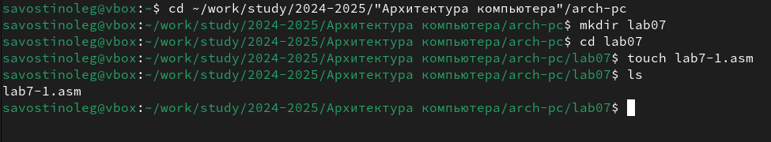{#fig:001 width=70%}

Вставляю в него листинг 7.1 из файла на ТУИС(рис. [-@fig:002]). Создаю исполняемый файл и запускаю его. (рис. [-@fig:003]).

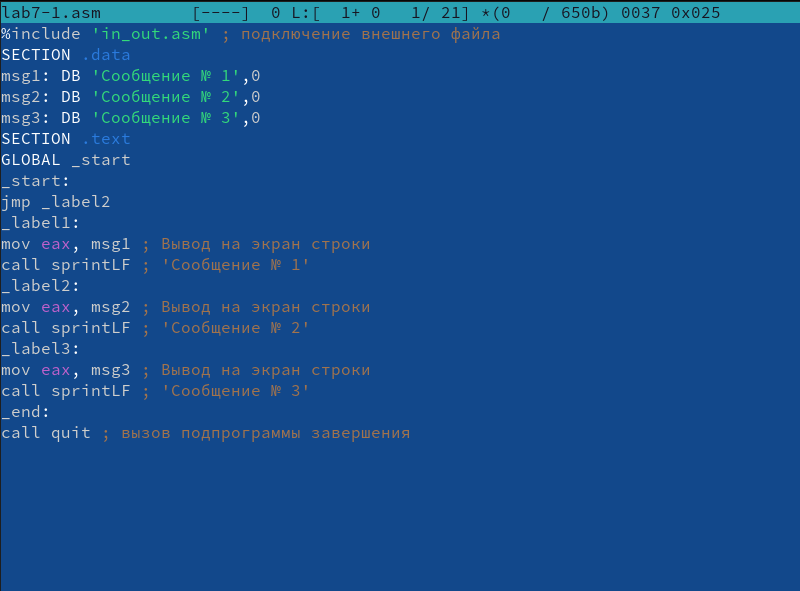{#fig:002 width=70%}

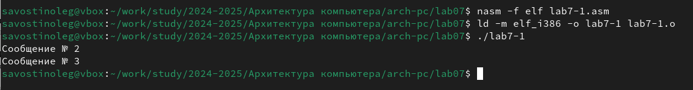{#fig:003 width=70%}

Изменяю текст файла так, чтобы выводились: 2, 1. Вставляю текст в файл из Листинга 7.2 (рис. [-@fig:004]). Создаю исполняемый файл и запускаю его. (рис. [-@fig:005]).

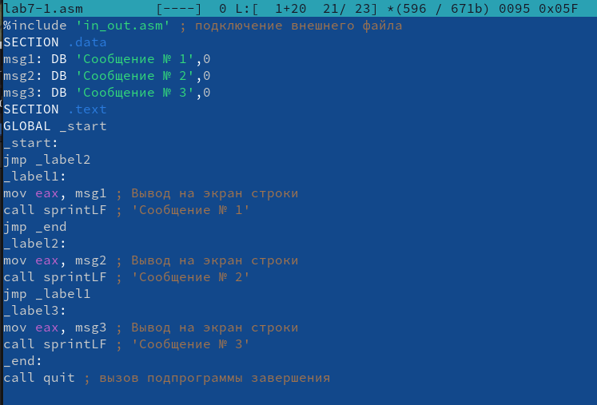{#fig:004 width=70%}

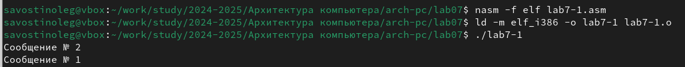{#fig:005 width=70%}

Теперь изменяю файл так, чтобы выводились все сообщения по порядку возрастания. Ввожу код (рис. [-@fig:006]). Затем создаю исполняемый файл и проверяю на правильность (рис. [-@fig:007]).

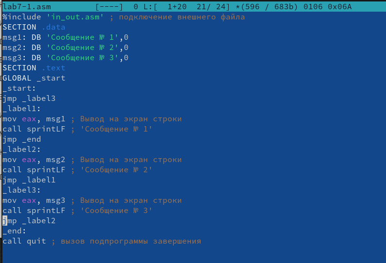{#fig:006 width=70%}

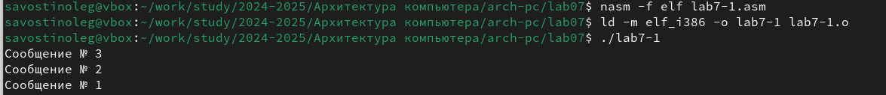{#fig:007 width=70%}

Создаю новый файл и вставляю в него текст из Листинга 7.3 (рис. [-@fig:008]).

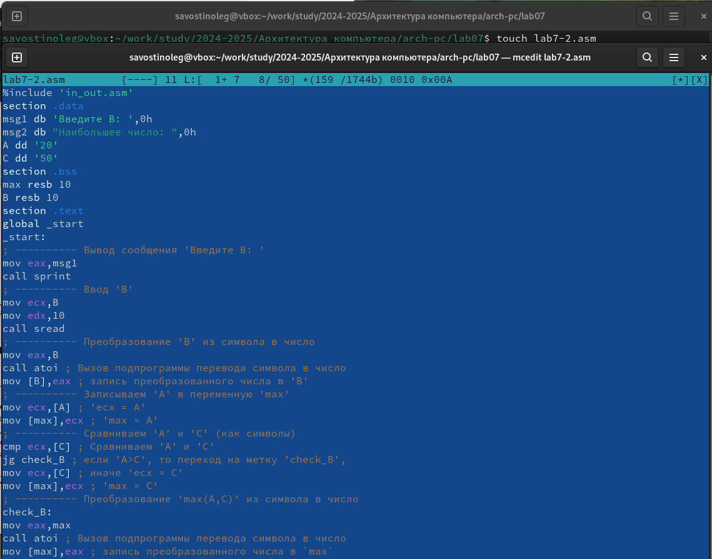{#fig:008 width=70%}

Создаю исполняемый файл(рис. [-@fig:009]) и проверяю что он делает (рис. [-@fig:010]).

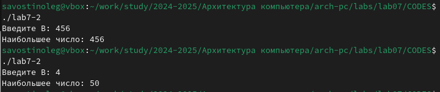{#fig:009 width=70%}

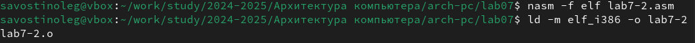{#fig:010 width=70%}

Для углубленного изучения файла, я создаю lab7-2.lst и изучаю содержимое(рис. [-@fig:011]).

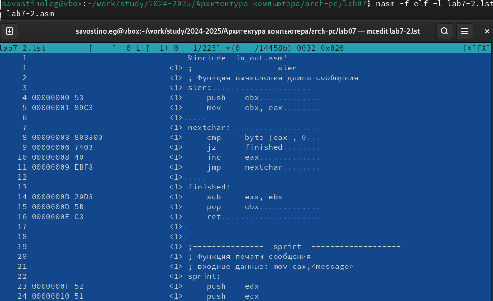{#fig:011 width=70%}

В данной строчке указан регистр на строчке 21. Её адрес - 00000101. Машинный код - В8[0A000000]. строчка содержит код mov eax,B, который переводит значение В в регистр  (рис. [-@fig:012]).

{#fig:012 width=70%}

В данной строчке указан регистр на строчке 23. Её адрес - 0000010В. Машинный код - А3[0A000000]. строчка содержит код mov [B], который переводит значение регистра в [B] (рис. [-@fig:013]).

{#fig:013 width=70%}

В данной строчке указан регистр на строчке 22. Её адрес - 00000106. Машинный код - E891FFFFFF. строчка содержит код call atoi который переводит символ, лежащий выше, в число(рис. [-@fig:014]).

{#fig:014 width=70%}

Удаляю строчку mov ecx,[max] (рис. [-@fig:015]). Пытаюсь создать исполняемый файл и .lst и получаю ошибку (рис. [-@fig:016]). Создается только lst. Открываю lst файл и нахожу ошибку, которая добавилась.(рис. [-@fig:017]).

{#fig:015 width=70%}

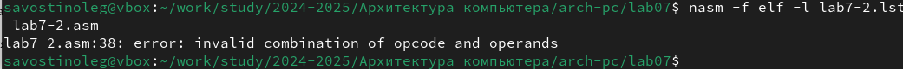{#fig:016 width=70%}

{#fig:017 width=70%}

## Выполнение заданий для самостоятельной работы

1. Сперва, пишу код который будет находить наименьшее число.(рис. [-@fig:018]).

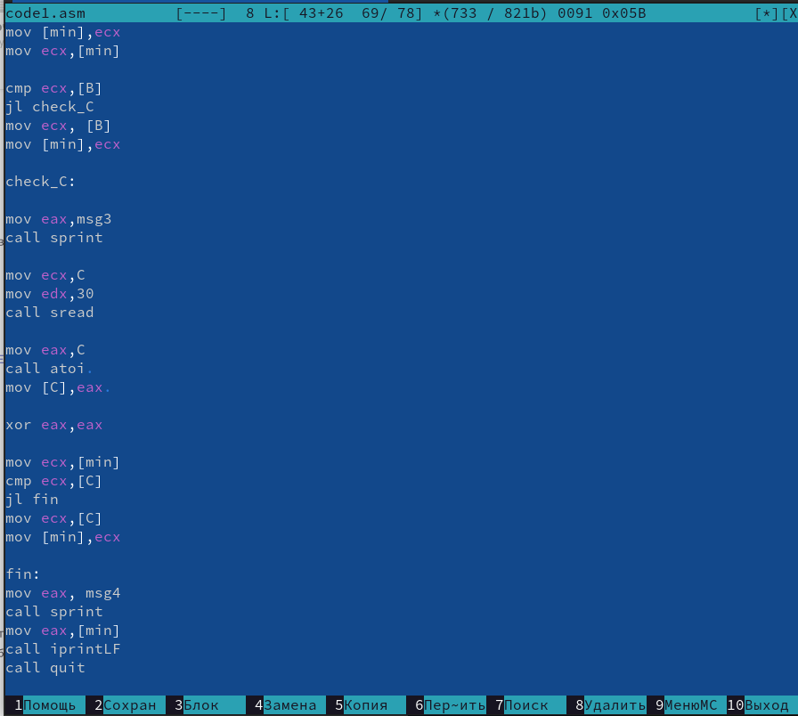{#fig:018 width=70%}

Создаю исполняемый, всё верно. (рис. [-@fig:019]).

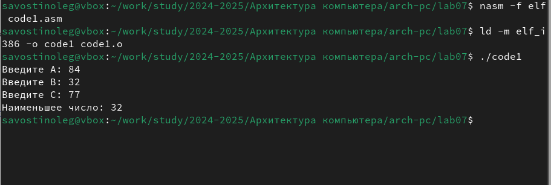{#fig:019 width=70%}

КОД
%include 'in_out.asm'

section .data

msg1 db 'Введите A: ',0h

msg2 db 'Введите B: ',0h

msg3 db 'Введите C: ',0h

msg4 db "Наименьшее число: ",0h

section .bss

min resb 30

A resb 30

B resb 30

C resb 30

section .text

global _start

_start:

mov eax,msg1

call sprint

mov ecx,A

mov edx,30

call sread

mov eax,A

call atoi

mov [A],eax

xor eax,eax

mov eax,msg2

call sprint

mov ecx,B

mov edx,30

call sread

mov eax,B

call atoi

mov [B],eax 

xor eax,eax

mov ecx, [A]

mov [min],ecx

mov ecx,[min]

cmp ecx,[B]

jl check_C

mov ecx, [B]

mov [min],ecx

check_C:

mov eax,msg3

call sprint

mov ecx,C

mov edx,30

call sread

mov eax,C

call atoi 

mov [C],eax 

xor eax,eax

mov ecx,[min]

cmp ecx,[C]

jl fin

mov ecx,[C]

mov [min],ecx

fin:

mov eax, msg4

call sprint

mov eax,[min]

call iprintLF

call quit

2. Теперь записываю код для следующей функции: a-7 a>=7 | ax a<7 (рис. [-@fig:020]).

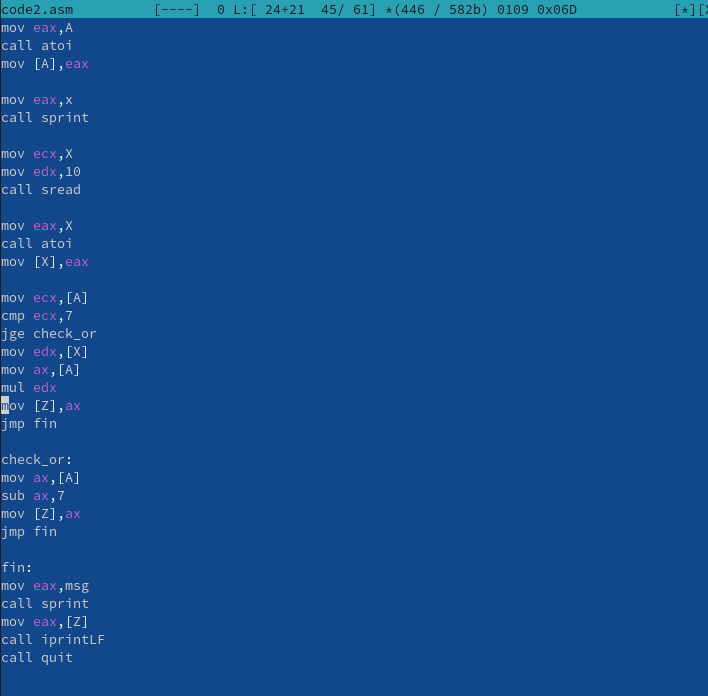{#fig:020 width=70%}

Проверяю на правильность написанного кода. Всё верно (рис. [-@fig:021]).

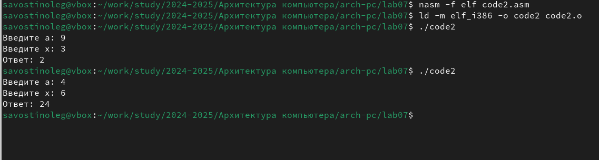{#fig:021 width=70%}

КОД

%include 'in_out.asm'

section .data

a db 'Введите a: ',0h

x db 'Введите x: ',0h

msg db "Ответ: ",0h

section .bss

X RESB 10

A RESB 10

Z RESB 10

section .text

global _start

_start:

mov eax,a

call sprint

mov ecx,A

mov edx,10

call sread

mov eax,A

call atoi

mov [A],eax

mov eax,x

call sprint

mov ecx,X

mov edx,10

call sread

mov eax,X

call atoi

mov [X],eax

mov ecx,[A]

cmp ecx,7

jge check_or
mov edx,[X]

mov ax,[A]

mul edx

mov [Z],ax

jmp fin

check_or:

mov ax,[A]

sub ax,7

mov [Z],ax

jmp fin

fin:

mov eax,msg

call sprint

mov eax,[Z]

call iprintLF

call quit

# Вывод.

В заключении я изучил команды условного и безусловного переходов. Приобрел навыков написания программ с использованием переходов. Ознакомился с назначением и структурой файла листинга.

# Список литературы{.unnumbered}

[Лабораторная работа
№7](https://esystem.rudn.ru/pluginfile.php/2089545/mod_resource/content/0/%D0%9B%D0%B0%D0%B1%D0%BE%D1%80%D0%B0%D1%82%D0%BE%D1%80%D0%BD%D0%B0%D1%8F%20%D1%80%D0%B0%D0%B1%D0%BE%D1%82%D0%B0%20%E2%84%967.%20%D0%9A%D0%BE%D0%BC%D0%B0%D0%BD%D0%B4%D1%8B%20%D0%B1%D0%B5%D0%B7%D1%83%D1%81%D0%BB%D0%BE%D0%B2%D0%BD%D0%BE%D0%B3%D0%BE%20%D0%B8%20%D1%83%D1%81%D0%BB%D0%BE%D0%B2%D0%BD%D0%BE%D0%B3%D0%BE%20%D0%BF%D0%B5%D1%80%D0%B5%D1%85%D0%BE%D0%B4%D0%BE%D0%B2%20%D0%B2%20Nasm.%20%D0%9F%D1%80%D0%BE%D0%B3%D1%80%D0%B0%D0%BC%D0%BC%D0%B8%D1%80%D0%BE%D0%B2%D0%B0%D0%BD%D0%B8%D0%B5%20%D0%B2%D0%B5%D1%82%D0%B2%D0%BB%D0%B5%D0%BD%D0%B8%D0%B9..pdf)

::: 
::
