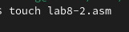

---
## Front matter
title: "Лабораторная работа №8"
subtitle: "Дисциплина: Архитектура компьютера"
author: "Савостин Олег"

## Generic otions
lang: ru-RU
toc-title: "Содержание"

## Bibliography
bibliography: bib/cite.bib
csl: pandoc/csl/gost-r-7-0-5-2008-numeric.csl

## Pdf output format
toc: true # Table of contents
toc-depth: 2
lof: true # List of figures
lot: true # List of tables
fontsize: 12pt
linestretch: 1.5
papersize: a4
documentclass: scrreprt
## I18n polyglossia
polyglossia-lang:
  name: russian
  options:
	- spelling=modern
	- babelshorthands=true
polyglossia-otherlangs:
  name: english
## I18n babel
babel-lang: russian
babel-otherlangs: english
## Fonts
mainfont: IBM Plex Serif
romanfont: IBM Plex Serif
sansfont: IBM Plex Sans
monofont: IBM Plex Mono
mathfont: STIX Two Math
mainfontoptions: Ligatures=Common,Ligatures=TeX,Scale=0.94
romanfontoptions: Ligatures=Common,Ligatures=TeX,Scale=0.94
sansfontoptions: Ligatures=Common,Ligatures=TeX,Scale=MatchLowercase,Scale=0.94
monofontoptions: Scale=MatchLowercase,Scale=0.94,FakeStretch=0.9
mathfontoptions:
## Biblatex
biblatex: true
biblio-style: "gost-numeric"
biblatexoptions:
  - parentracker=true
  - backend=biber
  - hyperref=auto
  - language=auto
  - autolang=other*
  - citestyle=gost-numeric
## Pandoc-crossref LaTeX customization
figureTitle: "Рис."
tableTitle: "Таблица"
listingTitle: "Листинг"
lofTitle: "Список иллюстраций"
lotTitle: "Список таблиц"
lolTitle: "Листинги"
## Misc options
indent: true
header-includes:
  - \usepackage{indentfirst}
  - \usepackage{float} # keep figures where there are in the text
  - \floatplacement{figure}{H} # keep figures where there are in the text
---

# Цель работы

Целью данной лабораторной работы является приобретение навыков написания программ с использованием циклов и обработкой аргументов командной строки

# Задание

1. Реализация циклов в NASM.
2. Обработка аргументов командной строки.
3. Выполнение заданий лабораторной работы.

# Теоретическое введение

Стек — это структура данных, организованная по принципу LIFO («Last In — First Out»
или «последним пришёл — первым ушёл»). Стек является частью архитектуры процессора и
реализован на аппаратном уровне. Для работы со стеком в процессоре есть специальные
регистры (ss, bp, sp) и команды.
Основной функцией стека является функция сохранения адресов возврата и передачи
аргументов при вызове процедур. Кроме того, в нём выделяется память для локальных
переменных и могут временно храниться значения регистров

Команда push размещает значение в стеке, т.е. помещает значение в ячейку памяти, на
которую указывает регистр esp, после этого значение регистра esp увеличивается на 4.
Данная команда имеет один операнд — значение, которое необходимо поместить в стек

Существует ещё две команды для добавления значений в стек. Это команда pusha, которая
помещает в стек содержимое всех регистров общего назначения в следующем порядке: ах,
сх, dx, bх, sp, bp, si, di. А также команда pushf, которая служит для перемещения в стек
содержимого регистра флагов. Обе эти команды не имеют операндов.

Команда pop извлекает значение из стека, т.е. извлекает значение из ячейки памяти, на
которую указывает регистр esp, после этого уменьшает значение регистра esp на 4. У этой
команды также один операнд, который может быть регистром или переменной в памяти

Аналогично команде записи в стек существует команда popa, которая восстанавливает
из стека все регистры общего назначения, и команда popf для перемещения значений из
вершины стека в регистр флагов.

Для организации циклов существуют специальные инструкции. Для всех инструкций
максимальное количество проходов задаётся в регистре ecx. Наиболее простой является инструкция loop. Она позволяет организовать безусловный цикл.

# Выполнение лабораторной работы

## Реализация циклов в NASM.

Сперва, создаю каталог и файл для лабораторной работы.(рис. [-@fig:001]).

{#fig:001 width=70%}

Вставляю в файл текст из Листинга 8.1 (рис. [-@fig:002]).

{#fig:002 width=70%}

Создаю исполняемый файл и проверяю его работу. Он считывает числa с N до 1 (рис. [-@fig:003]).

{#fig:003 width=100%}

Изменяю текст файла, добавив изменение значение регистра еах в цикле (рис. [-@fig:004]).

{#fig:004 width=70%}

Создаю исполняемый файл. При запуске исполняемого файла, код считывает с N до 0, но затем начинается счет с 4294967294.(рис. [-@fig:005]).

{#fig:005 width=100%}

Чтобы сохранить корректность программы, использую команду рор (рис. [-@fig:006]).

{#fig:006 width=70%}

Создаю исполняемый файл. Все работает корректно, однако, он теперь считает числа с N до 0 (рис. [-@fig:007]).

{#fig:007 width=100%}

## Обработка аргументов командной строки

Создаю новый файл (рис. [-@fig:008]) и записываю в него текст из Листинга 8.2 (рис. [-@fig:009]).

{#fig:008 width=70%}

{#fig:009 width=70%}

Теперь запускаю файл с тремя аргументами. Обработались все три, однако, аргумент 2 был выписан по другому. Это произошло, так как он засчитал этот аргумент как два разных элемента. Если записать его как третий аргумент, то он будет выведен идентично ему. (рис. [-@fig:010]).

{#fig:010 width=100%}

Создаю третий файл(рис. [-@fig:011]) и ввожу в него код из Листинга 8.3(рис. [-@fig:012]).

{#fig:011 width=70%}

{#fig:012 width=70%}

Создаю исполняемый файл и проверяю на его работу. (рис. [-@fig:013]).

{#fig:013 width=100%}

Изменяю код так, чтобы вместо вычисления суммы, он вычислял произведение аргументов (рис. [-@fig:014]).

{#fig:014 width=70%}

Создаю исполняемый файл и проверяю. Все готово(рис. [-@fig:015]).

{#fig:015 width=100%}

КОД

%include 'in_out.asm'

SECTION .data

msg db "Результат: ",0

SECTION .text

global _start

_start:

pop ecx

pop edx 

sub ecx,1 

mov esi,1

mov eax,1

next:

cmp ecx,0h ;

jz _end 

pop eax 

call atoi

mov ebx,eax

mov eax,esi

mul ebx

mov esi,eax

loop next

_end:

mov eax, msg 

call sprint

mov eax, esi 

call iprintLF 

call quit

##Задание для самостоятельной работы

У меня 13 вариант, я сделал программу, вычисляющая сумму всех f(x)=12x-7(рис. [-@fig:016]).

{#fig:016 width=100%}

Проверяю на его правильность. Программа работает (рис. [-@fig:017]).

{#fig:017 width=100%}

КОД

%include 'in_out.asm'

SECTION .data

funct db "f(x)=12x-7",0

msg db "Результат: ",0

SECTION .text

global _start

_start:

pop ecx

pop edx 

sub ecx,1 

mov esi,0

mov eax,funct

call sprintLF

next:

cmp ecx,0h ;

jz _end 

mov ebx,12

pop eax 

call atoi

mul ebx

sub eax,7

add esi,eax

loop next

_end:

mov eax, msg 

call sprint

mov eax, esi 

call iprintLF 

call quit

# Выводы

В ходе данной работы я приобрел навыкы написания программ с использованием циклов и обработкой аргументов командной строки

# Список литературы{.unnumbered}
[Лабораторная работа
№8](https://esystem.rudn.ru/pluginfile.php/2089548/mod_resource/content/0/%D0%9B%D0%B0%D0%B1%D0%BE%D1%80%D0%B0%D1%82%D0%BE%D1%80%D0%BD%D0%B0%D1%8F%20%D1%80%D0%B0%D0%B1%D0%BE%D1%82%D0%B0%20%E2%84%968.%20%D0%9F%D1%80%D0%BE%D0%B3%D1%80%D0%B0%D0%BC%D0%BC%D0%B8%D1%80%D0%BE%D0%B2%D0%B0%D0%BD%D0%B8%D0%B5%20%D1%86%D0%B8%D0%BA%D0%BB%D0%B0.%20%D0%9E%D0%B1%D1%80%D0%B0%D0%B1%D0%BE%D1%82%D0%BA%D0%B0%20%D0%B0%D1%80%D0%B3%D1%83%D0%BC%D0%B5%D0%BD%D1%82%D0%BE%D0%B2%20%D0%BA%D0%BE%D0%BC%D0%B0%D0%BD%D0%B4%D0%BD%D0%BE%D0%B9%20%D1%81%D1%82%D1%80%D0%BE%D0%BA%D0%B8..pdf)
::: {#refs}
:::
