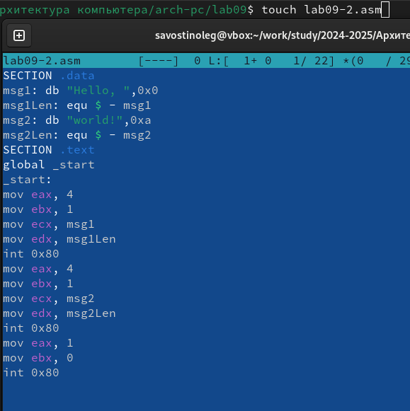

---
## Front matter
title: "Лабораторная работа №6"
subtitle: "Дисциплина: Архитектура компьютера"
author: "Савостин Олег"

## Generic otions
lang: ru-RU
toc-title: "Содержание"

## Bibliography
bibliography: bib/cite.bib
csl: pandoc/csl/gost-r-7-0-5-2008-numeric.csl

## Pdf output format
toc: true # Table of contents
toc-depth: 2
lof: true # List of figures
lot: true # List of tables
fontsize: 12pt
linestretch: 1.5
papersize: a4
documentclass: scrreprt
## I18n polyglossia
polyglossia-lang:
  name: russian
  options:
	- spelling=modern
	- babelshorthands=true
polyglossia-otherlangs:
  name: english
## I18n babel
babel-lang: russian
babel-otherlangs: english
## Fonts
mainfont: IBM Plex Serif
romanfont: IBM Plex Serif
sansfont: IBM Plex Sans
monofont: IBM Plex Mono
mathfont: STIX Two Math
mainfontoptions: Ligatures=Common,Ligatures=TeX,Scale=0.94
romanfontoptions: Ligatures=Common,Ligatures=TeX,Scale=0.94
sansfontoptions: Ligatures=Common,Ligatures=TeX,Scale=MatchLowercase,Scale=0.94
monofontoptions: Scale=MatchLowercase,Scale=0.94,FakeStretch=0.9
mathfontoptions:
## Biblatex
biblatex: true
biblio-style: "gost-numeric"
biblatexoptions:
  - parentracker=true
  - backend=biber
  - hyperref=auto
  - language=auto
  - autolang=other*
  - citestyle=gost-numeric
## Pandoc-crossref LaTeX customization
figureTitle: "Рис."
tableTitle: "Таблица"
listingTitle: "Листинг"
lofTitle: "Список иллюстраций"
lotTitle: "Список таблиц"
lolTitle: "Листинги"
## Misc options
indent: true
header-includes:
  - \usepackage{indentfirst}
  - \usepackage{float} # keep figures where there are in the text
  - \floatplacement{figure}{H} # keep figures where there are in the text
---

# Цель работы

Целью работы является приобретение навыков написания программ с использованием подпрограмм. Знакомство с методами отладки при помощи GDB и его основными возможностями

# Задание

1. Реализация подпрограмм в NASM
2. Отладка программам с помощью GDB
3. Выполнение заданий для самостоятельной работы

# Теоретическое введение

Отладка — это процесс поиска и исправления ошибок в программе. В общем случае его
можно разделить на четыре этапа:
• обнаружение ошибки;
• поиск её местонахождения;
• определение причины ошибки;
• исправление ошибки.
Можно выделить следующие типы ошибок:
• синтаксические ошибки — обнаруживаются во время трансляции исходного кода и
вызваны нарушением ожидаемой формы или структуры языка;
• семантические ошибки — являются логическими и приводят к тому, что программа
запускается, отрабатывает, но не даёт желаемого результата;
• ошибки в процессе выполнения — не обнаруживаются при трансляции и вызывают пре-
рывание выполнения программы (например, это ошибки, связанные с переполнением
или делением на ноль).
Второй этап — поиск местонахождения ошибки. Некоторые ошибки обнаружить доволь-
но трудно. Лучший способ найти место в программе, где находится ошибка, это разбить
программу на части и произвести их отладку отдельно друг от друга.
Третий этап — выяснение причины ошибки. После определения местонахождения ошибки
обычно проще определить причину неправильной работы программы.
Последний этап — исправление ошибки. После этого при повторном запуске программы,
может обнаружиться следующая ошибка, и процесс отладки начнётся заново.

Наиболее часто применяют следующие методы отладки:
• создание точек контроля значений на входе и выходе участка программы (например,
вывод промежуточных значений на экран — так называемые диагностические сообще-
ния);
• использование специальных программ-отладчиков.
Отладчики позволяют управлять ходом выполнения программы, контролировать и из-
менять данные. Это помогает быстрее найти место ошибки в программе и ускорить её
исправление. Наиболее популярные способы работы с отладчиком — это использование
точек останова и выполнение программы по шагам.
Пошаговое выполнение — это выполнение программы с остановкой после каждой строчки,
чтобы программист мог проверить значения переменных и выполнить другие действия.
Точки останова — это специально отмеченные места в программе, в которых программа-
отладчик приостанавливает выполнение программы и ждёт команд. Наиболее популярные
виды точек останова

GDB (GNU Debugger — отладчик проекта GNU) [1] работает на многих UNIX-подобных
системах и умеет производить отладку многих языков программирования. GDB предлагает
обширные средства для слежения и контроля за выполнением компьютерных программ. От-
ладчик не содержит собственного графического пользовательского интерфейса и использует
стандартный текстовый интерфейс консоли. Однако для GDB существует несколько сторон-
них графических надстроек, а кроме того, некоторые интегрированные среды разработки
используют его в качестве базовой подсистемы отладки

Синтаксис команды для запуска отладчика имеет следующий вид:
gdb [опции] [имя_файла | ID процесса]

Если есть файл с исходным текстом программы, а в исполняемый файл включена информа-
ция о номерах строк исходного кода, то программу можно отлаживать, работая в отладчике
непосредственно с её исходным текстом. Чтобы программу можно было отлаживать на
уровне строк исходного кода, она должна быть откомпилирована с ключом -g.
Посмотреть дизассемблированный код программы можно с помощью команды
disassemble <метка/адрес>:
(gdb) disassemble _start

Установить точку останова можно командой break (кратко b). Типичный аргумент этой
команды — место установки. Его можно задать как имя метки или как адрес. Чтобы не было
путаницы с номерами, перед адресом ставится «звёздочка»:
(gdb) break *<адрес>
(gdb) b <метка>
Информацию о всех установленных точках останова можно вывести командой info (крат-
ко i):
(gdb) info breakpoints
(gdb) i b
Как уже упоминалось, отладчик может показывать содержимое ячеек памяти и регистров,
а при необходимости позволяет вручную изменять значения регистров и переменных.
Посмотреть содержимое регистров можно с помощью команды info registers (или i
r):
(gdb) info registers

Подпрограмма — это, как правило, функционально законченный участок кода, который
можно многократно вызывать из разных мест программы. В отличие от простых переходов
из подпрограмм существует возврат на команду, следующую за вызовом

# Выполнение лабораторной работы

## Реализация подпpограмм в NASM

Создаю нужные файлы и вставляю в .asm файл текст из листинга (рис. [-@fig:001]).(рис. [-@fig:002]).

{#fig:001 width=85%}

{#fig:002 width=85%}

Проверяю его на работу и создаю исполняемый файл (рис. [-@fig:003]).

{#fig:003 width=85%}

Изменяю текст файла Листинга (рис. [-@fig:004]), чтобы он имел выводил сложную функцию (рис. [-@fig:005]).

{#fig:004 width=85%}

{#fig:005 width=85%}

## Отладка программам с помощью GDB

Создаю файл и вставляю в него Листинг 9.2(рис. [-@fig:006]).

{#fig:006 width=85%}

Создаю исполняемый файл и .lst (рис. [-@fig:007]) и запускаю gdb (рис. [-@fig:008]). Ставлю брекпоинт на _start.

{#fig:007 width=85%}

{#fig:008 width=100%}

Начиная с метки, просматриваю дисассимплированный код (рис. [-@fig:009]) и переключаюсь на intel'овское отображение синтаксиса. Отличие заключается в командах, в диссамилированном отображении в командах используют % $, а в Intel эти символы не отображены, тем самым так удобнее.

{#fig:009 width=85%}

Использую layout asm (рис. [-@fig:010]) layout regs (рис. [-@fig:011]).

{#fig:010 width=85%}

{#fig:011 width=85%}

Проверяю на наличие меток (рис. [-@fig:012]). Добавляю одну метку(рис. [-@fig:013]).

{#fig:012 width=85%}

{#fig:013 width=85%}

С помощью команды si я посмотрел регистры (рис. [-@fig:014]).

{#fig:014 width=85%}

Просматриваю значения msg1 msg2 и изменяю их(рис. [-@fig:015]).

{#fig:015 width=85%}

Изменяю значение регистра ebx. Выводятся два разных значения так как в первом случае вводится значение 2, а во второй раз регистр равен 2. (рис. [-@fig:016]).

{#fig:016 width=85%}

Проверка значений регистров (рис. [-@fig:017]).

{#fig:017 width=85%}

Выхожу из программы(рис. [-@fig:018]).

{#fig:018 width=85%}

Теперь, я скопировал файл lab8-2.asm и переименовал его в lab09-3.asm. Добавляю метку и  запускаю файл(рис. [-@fig:019]).

{#fig:019 width=85%}

Проверяю адрес вершины стека. Там хранится 5 элементов. По первому адресу находится адрес а в остальных хранятся элементы. Элементы расположены с интервалом в 4 единиицы. Стек может хранить до 4 байт. Компьютер использует новый стек для новой информации чтобы данные сохранялись нормально и без помех (рис. [-@fig:020]).

{#fig:020 width=85%}

## Выполнение самостоятельной работы.

1. Копирую файл из лабораторной работы 8 и переделываю текст файла, чтобы он работал с помощью подпрограммы (рис. [-@fig:021]).

{#fig:021 width=85%}

Проверяю на правильность работы (рис. [-@fig:022]).

{#fig:022 width=85%}

2. Создаю файл, и вставляю в него код из лабораторной работы. Проверяю на правильность. Выходит ошибка, так как (3+2)*4+5 не равно 10. (рис. [-@fig:023]).

{#fig:023 width=85%}

Запускаю gdb, ошибка арифметическая (рис. [-@fig:024]). Анализирую код(рис. [-@fig:025]).

{#fig:024 width=85%}

{#fig:025 width=85%}

Изменяю текст кода (рис. [-@fig:026]). Исправленный код(рис. [-@fig:027]).

{#fig:026 width=85%}

{#fig:027 width=85%}

Проверяю на правильность. Все верно(рис. [-@fig:028]).

{#fig:028 width=85%}

# Выводы

В ходе работы, я приобрел навыки написания программ с использованием подпрограмм. Ознакомился с методами отладки при помощи GDB и его основными возможностями

# Список литературы{.unnumbered}

[Лабораторная работа
№9](https://esystem.rudn.ru/pluginfile.php/2089551/mod_resource/content/0/%D0%9B%D0%B0%D0%B1%D0%BE%D1%80%D0%B0%D1%82%D0%BE%D1%80%D0%BD%D0%B0%D1%8F%20%D1%80%D0%B0%D0%B1%D0%BE%D1%82%D0%B0%20%E2%84%969.%20%D0%9F%D0%BE%D0%BD%D1%8F%D1%82%D0%B8%D0%B5%20%D0%BF%D0%BE%D0%B4%D0%BF%D1%80%D0%BE%D0%B3%D1%80%D0%B0%D0%BC%D0%BC%D1%8B.%20%D0%9E%D1%82%D0%BB%D0%B0%D0%B4%D1%87%D0%B8%D0%BA%20..pdf)

::: {#refs}
:::
