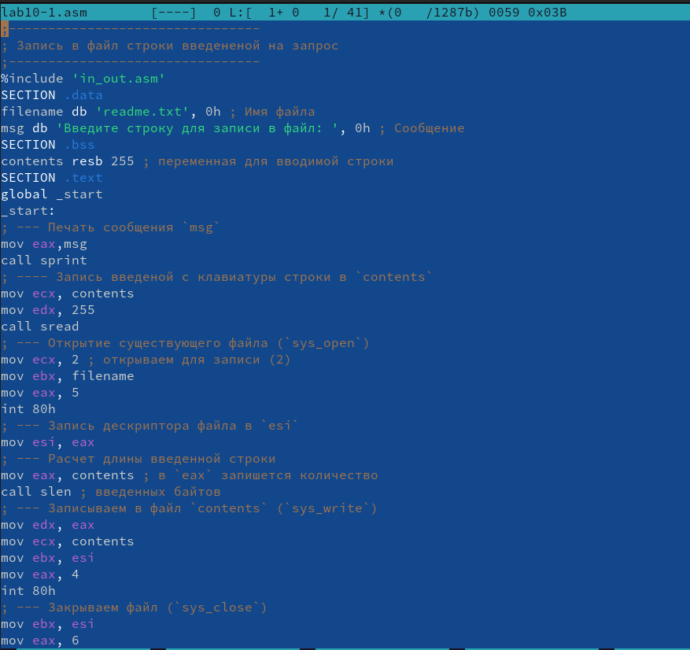
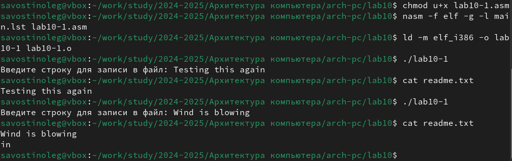

---
## Front matter
title: "Лабораторная работа №10"
subtitle: "Работа с файлами средствами Nasm"
author: "Савостин Олег"

## Generic otions
lang: ru-RU
toc-title: "Содержание"

## Bibliography
bibliography: bib/cite.bib
csl: pandoc/csl/gost-r-7-0-5-2008-numeric.csl

## Pdf output format
toc: true # Table of contents
toc-depth: 2
lof: true # List of figures
lot: true # List of tables
fontsize: 12pt
linestretch: 1.5
papersize: a4
documentclass: scrreprt
## I18n polyglossia
polyglossia-lang:
  name: russian
  options:
	- spelling=modern
	- babelshorthands=true
polyglossia-otherlangs:
  name: english
## I18n babel
babel-lang: russian
babel-otherlangs: english
## Fonts
mainfont: IBM Plex Serif
romanfont: IBM Plex Serif
sansfont: IBM Plex Sans
monofont: IBM Plex Mono
mathfont: STIX Two Math
mainfontoptions: Ligatures=Common,Ligatures=TeX,Scale=0.94
romanfontoptions: Ligatures=Common,Ligatures=TeX,Scale=0.94
sansfontoptions: Ligatures=Common,Ligatures=TeX,Scale=MatchLowercase,Scale=0.94
monofontoptions: Scale=MatchLowercase,Scale=0.94,FakeStretch=0.9
mathfontoptions:
## Biblatex
biblatex: true
biblio-style: "gost-numeric"
biblatexoptions:
  - parentracker=true
  - backend=biber
  - hyperref=auto
  - language=auto
  - autolang=other*
  - citestyle=gost-numeric
## Pandoc-crossref LaTeX customization
figureTitle: "Рис."
tableTitle: "Таблица"
listingTitle: "Листинг"
lofTitle: "Список иллюстраций"
lotTitle: "Список таблиц"
lolTitle: "Листинги"
## Misc options
indent: true
header-includes:
  - \usepackage{indentfirst}
  - \usepackage{float} # keep figures where there are in the text
  - \floatplacement{figure}{H} # keep figures where there are in the text
---

# Цель работы

Целью работы является приобретение навыков написания программ для работы с файлами.

# Задание

1. Лабораторная работа
2. Самостоятельная работа

# Теоретическое введение

ОС GNU/Linux является многопользовательской операционной системой. И для обеспече-
ния защиты данных одного пользователя от действий других пользователей существуют
специальные механизмы разграничения доступа к файлам. Кроме ограничения доступа, дан-
ный механизм позволяет разрешить другим пользователям доступ данным для совместной
работы.
Права доступа определяют набор действий (чтение, запись, выполнение), разрешённых
для выполнения пользователям системы над файлами. Для каждого файла пользователь
может входить в одну из трех групп: владелец, член группы владельца, все остальные. Для
каждой из этих групп может быть установлен свой набор прав доступа. Владельцем файла
является его создатель. Для предоставления прав доступа другому пользователю или другой
группе командой

Для записи в файл служит системный вызов sys_write, который использует следующие
аргументы: количество байтов для записи в регистре EDX, строку содержимого для записи
ECX, файловый дескриптор в EBX и номер системного вызова sys_write (4) в EAX.
Системный вызов возвращает фактическое количество записанных байтов в регистр EAX.
В случае ошибки, код ошибки также будет находиться в регистре EAX.
Прежде чем записывать в файл, его необходимо создать или открыть, что позволит полу-
чить дескриптор файла

Для чтения данных из файла служит системный вызов sys_read, который использует
следующие аргументы: количество байтов для чтения в регистре EDX, адрес в памяти для
записи прочитанных данных в ECX, файловый дескриптор в EBX и номер системного вызова
sys_read (3) в EAX. Как и для записи, прежде чем читать из файла, его необходимо открыть,
что позволит получить дескриптор файла

Для изменения содержимого файла служит системный вызов sys_lseek, который исполь-
зует следующие аргументы: исходная позиция для смещения EDX, значение смещения в
байтах в ECX, файловый дескриптор в EBX и номер системного вызова sys_lseek (19) в EAX.

# Выполнение лабораторной работы

## Лабораторная работа

Создаю нужные файлы для лабораторной работы (рис. [-@fig:001]).

{#fig:001 width=70%}

Вставляю в файл lab10-1.asm текст кода из Листинга 10.1 (рис. [-@fig:002]).

{#fig:002 width=70%}

Создаю исполняемый файл и запускаю его. (рис. [-@fig:003]).

{#fig:003 width=70%}

С помощью команды chmod, я запретил выполнять программу. Программа не была запущена, что было ожидаемо, так как я запретил запускать его владельцу. то есть себе. (рис. [-@fig:004]).

{#fig:004 width=70%}

С помощью команды я дал разрешение на исполнение файлу с исходным текстом и создал новую программу. Она заработала, так как файл был со всеми разрешениями. До этого я запретил запускаться  готовой программе, а это  новая программа которая обладает другими разрешениями. Поэтому она запустилась(рис. [-@fig:005]).

{#fig:005 width=70%}

В соответствии с вариантом в таблице 10.4 предоставляю права доступа к файлу readme-1.txt представленные в символьном виде. У меня вариант 13. (рис. [-@fig:006]).

{#fig:006 width=100%}

Повторяю подобные операции, только с другим файлом. В двочном виде. (рис. [-@fig:007]).

{#fig:007 width=100%}

## Самостоятельная работа

Я написал код и создал программу, которая создает текстовый файл с текстов, введеный мной при исполнении программы. (рис. [-@fig:008]) (рис. [-@fig:009]).

{#fig:008 width=70%}

{#fig:009 width=70%}

# Выводы

В заключении, я приобрел навыки написания программ для работы с файлами.

# Список литературы{.unnumbered}

1. [Лабораторная работа №10](https://esystem.rudn.ru/pluginfile.php/2089554/mod_resource/content/0/%D0%9B%D0%B0%D0%B1%D0%BE%D1%80%D0%B0%D1%82%D0%BE%D1%80%D0%BD%D0%B0%D1%8F%20%D1%80%D0%B0%D0%B1%D0%BE%D1%82%D0%B0%20%E2%84%9610.%20%D0%A0%D0%B0%D0%B1%D0%BE%D1%82%D0%B0%20%D1%81%20%D1%84%D0%B0%D0%B9%D0%BB%D0%B0%D0%BC%D0%B8%20%D1%81%D1%80%D0%B5%D0%B4%D1%81%D1%82%D0%B2%D0%B0%D0%BC%D0%B8%20Nasm.pdf)

::: {#refs}
::: 
